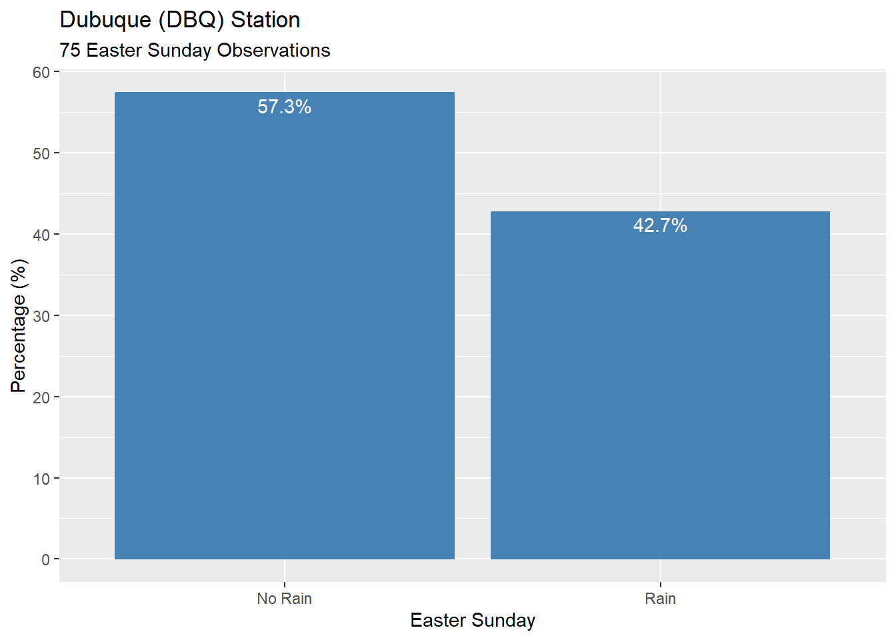
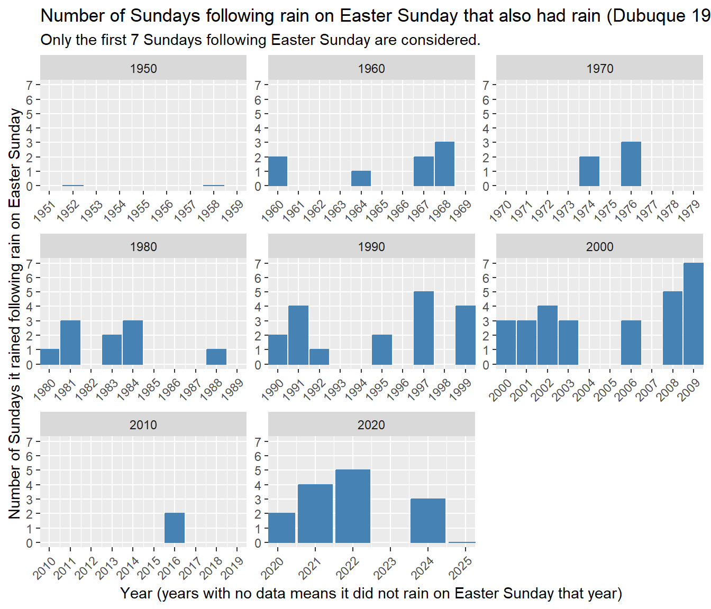

# Rain on Easter Sunday

### Note

This work was done using R and RStudio. The R Markdown (Rmd) file is included in the repository.
The easiest way to view the R Markdown with the code is to view it on my RPubs page. Here is the link to this project on my RPubs page: <https://rpubs.com/AIDataDr/rain_on_easter_sunday>

## Background

When I was a kid my father and his father, my grandfather, use to say "if it rains on Easter Sunday it will rain the next seven Sundays." Even as a kid I questioned, could that really be true? I remember trying to count how many consecutive Sundays it would rain following rain on Easter Sunday but I never managed to successfully keep track of it to know if it actually rained for the next seven Sundays or not.

This work will attempt to either prove the old saying true or debunk it by analyzing the weather data for one location. The one location used for this work will be Dubuque, Iowa and that is only because that is the station closest to where I grew up as a kid and also closest to where both my father and grandfather grew up. This work could easily be expanded and modified a little to study other locations as well.

The question this work will answer is:

* For Dubuque, Iowa, if it rained on Easter Sunday, did it rain the next seven Sundays following Easter?

## The Data

The data required to answer this question is straight forward, only two datasets are needed:

* The first dataset required is, weather data for Dubuque, Iowa that has both the date and the amount of rain for the day
* The second dataset required is, the dates of Easter Sunday going back in history as far as the weather data

The following sections will discuss the two datasets used for this work.

### Weather Data

A few years ago when I was working on a different project that required weather data for building net load forecasting models for a utility company, a local meteorologist pointed me to the Iowa Environmental Mesonet site hosted by Iowa State University. You can find the site here: <https://mesonet.agron.iastate.edu/>

The disclaimer page explains how while they strive to provide accurate information there may be errors and therefore the data is provided as is without any warranty of accuracy. It states how the data is part of the public domain and can be freely used. It also points out how the Iowa Environmental Mesonet is a volunteer effort  and receives no funding and that it may be discontinued at any time with little or no notice. See the disclaimer page for more details <https://mesonet.agron.iastate.edu/disclaimer.php>

For this simple work the source of the weather data seems to be a reliable and accurate source. However, it is a public data set, it is handled as volunteer effort, thus, if the accuracy of the data was highly critical for the project it would be worth trying to get in touch with the owners of the data to have a conversation to try to determine how trustworthy the data is or not. Additionally, other weather data sources could be found and used to compare with this data as well. However, that is out of the scope of this work.

The data used for this work can be found from the following page:
<https://mesonet.agron.iastate.edu/request/daily.phtml>

This page lets you select the stations you want data for, the range of the data, what variables you want, how missing values should be treated, and the download format for the data. Once you make the desired selections it updates an example automation curl for automating the data extraction, which provides a direct link that can be used to request the data in the desired format.

The selected stations to gather data for are:

* DBQ -- Dubuque (1951-Now)
* ALO -- Waterloo (1949-Now)
* BRL -- Burlington (1931-Now)
* CID -- Cedar Rapids (1972-Now)
* DSM -- Des Moines (1928-Now)

Looking at the station list it is seen that Dubuque has data going back to 1951. At the time of this work it is 2025 so that is 75 years of data, so not a lot but enough for answering the question for this work.

The date range for the data will be from 1900-01-01 to 2025-07-22 (Year-Month-Day)
Note that this is the default date range and was used as is, even though the data does not go all the way back to 1900.
Start: Year = 1900, Month = Jan, Day = 1
End:   Year = 2025, Month = Jul, Day = 22

By default all the available daily variables for the dataset are selected for the data request. The list of variables is below. Looking through the list the variable named precip_in is the variable for the Daily Precipitation in units of inches. This will be the key variable used for this work to know if it rained or not, i.e., if precip_in is greater than zero then it rained.

Select from available daily variables
Note: Values of 0.0001 inches are Trace Reports
 
* [max_temp_f] Maximum Air Temperature [F].
* [min_temp_f] Minimum Air Temperature [F].
* [max_dewpoint_f] Maximum Dew Point [F].
* [min_dewpoint_f] Minimum Dew Point [F].
* [precip_in] Daily Precipitation [inch].
* [avg_wind_speed_kts] Average Wind Speed [knots]
* [avg_wind_drct] Average Wind Direction [deg]
* [min_rh] Minimum Relative Humidity [%]
* [avg_rh] Average Relative Humidity [%]: computed by time averaging the available reports, it is not average of the daily max/min.
* [max_rh] Maximum Relative Humidity [%]
* [climo_high_f] NCEI 1991-2020 Daily High Temperature Climatology [F]
* [climo_low_f] NCEI 1991-2020 Daily Low Temperature Climatology [F]
* [climo_precip_in] NCEI 1991-2020 Daily Precipitation Climatology [inch]
* [snow_in] Reported Snowfall [inch]
* [snowd_in] Reported Snow Depth [inch]
* [min_feel] Minimum 'Feels Like' (either wind chill or heat index) temperature. The value is always at least the air temperature.
* [avg_feel] Average 'Feels Like' (either wind chill or heat index) temperature. The value is always at least the air temperature. Value is a time weighted average.
* [max_feel] Maximum 'Feels Like' (either wind chill or heat index) temperature. The value is always at least the air temperature.
* [max_wind_speed_kts] Maximum sustained wind speed in knots.
* [max_wind_gust_kts] Maximum wind gust in knots.
* [srad_mj] Daily Solar Radiation MJ/m2 (when available).

### Easter Sunday Dates

The second dataset required to answer the question is the Easter Sunday dates. Finding this data was a little interesting as Easter is not a fixed day of the month every year. After an initial search I found how the date of Easter is calculated from the USCCB site, see the link below.

USCC site that provides information for how Easter Sunday dates are determined.
<https://www.usccb.org/prayer-worship/liturgical-year/easter#tab--how-are-the-dates-for-easter-palm-sunday-and-ash-wednesday-determined>

The site says this: "Easter is celebrated on the first Sunday after the Paschal full moon, which is the first full moon occurring either on or after the spring equinox (March 21). As a result, Easter will always fall between March 22 and April 25."

I never knew that was how the Easter date was determined. The site provided a date range for which Easter could fall. It also means if we can determine the date of the Paschal full moon for each year, then we can determine the date of Easter.

After doing some research on the Paschal full moon this led me to the Wikipedia page on the Ecclesiastical full moon. The page explains how the paschal full moon corresponds to the ecclesiastical full moon for the northern spring. It also explains how the ecclesiastical equinox is a fixed date by the Gregorian reform of the calendar. Here is the link to the Wikipedia page where you can read all the details. <https://en.wikipedia.org/wiki/Ecclesiastical_full_moon>

At the end of the Wikipedia page under the References section are these two references:

* "Easter Dating Method - Calculate the Date of Easter Sunday". www.assa.org.au. Retrieved 2022-09-29. <https://www.assa.org.au/edm/>
*  "Easter Dates from 1600 to 2099". Census.gov. United States Census Bureau. Retrieved 2022-09-29. <https://www.census.gov/data/software/x13as/genhol/easter-dates.html>

After reviewing both sites from the references and comparing some of the Easter dates, both sites seemed to agree with each other. Note that I did not compare every single date.

Additionally, I checked the Easter dates on the census.gov site to the 'Holidays in United States' Google calendar for the years 2020-2030.
Here is the link to 'Holidays in United States' calendar <https://calendar.google.com/calendar/embed?src=en.usa%23holiday%40group.v.calendar.google.com&ctz=America%2FChicago>

All the Easter dates on the census.gov site from 2020-2030 agree with the dates on the calendar. Therefore, I am assuming this is a good and accurate source for Easter dates.

For this work the Easter dates I am using are from the census.gov site. This is because a link to an Excel file and a text file for the dates was provided. I downloaded the Excel file and used it locally for this work.

Here are the direct links to the Excel and corresponding text file that contain the Easter dates used for this work.

* Direct link to Excel file: <https://www2.census.gov/software/x-13arima-seats/win-genhol/documentation/easter500.xls>
* Direct link to text file: <https://www2.census.gov/software/x-13arima-seats/win-genhol/download/easter500.txt>

## Get, Prepare, and Process the Data

- The data was obtained from the sources described previously.
- After obtaining the data it was previwed and data cleaning was done to check for missing data and outliers.
- Dates were converted to date formats so that the data could easily be filtered as needed.
- The weather data was filtered to the Dubuque station.
- The Easter Sunday dates were filtered to only the dates for the weather data of the Dubuque station.
- The seven Sundays following Easter Sunday were added to the Easter Sunday data set.

After cleaning and preparing the data for analysis the next step was to check how many Easter Sundays actually had rain. The below plot shows the percentages for the Easter Sundays that had no rain and rain.

The below plot shows the number of Easter Sundays that had no rain and rain.

As seen from the plots 32 of the 75 Easter Sundays (42.7%) had rain, so just a little less than half. That seems like a large enough percentage that the data can provide some meaningful insight for answering the question.

## Rain on Easter Sunday &rarr; Number of Following Sundays it Rained

Now to answer the question, if it rained on Easter Sunday, did it rain the next 7 Sundays?

- To answer this question the Dubuque station data was filtered for only Easter Sundays that had a precipitation greater than zero, i.e., any recorded precipitation regardless of how much.
- The number of Sundays with rain following rain on Easter Sunday was determined.

The visualization below shows the number of Sundays out of the first seven Sundays following Easter Sunday that it rained when it rained on Easter Sunday. The plots are broken up by decade to make them more readable.

## Conclusion

Viewing the charts above, it is clearly seen that 2009 was the only year that it rained on Easter Sunday and rained the seven Sundays following Easter. There was only one year out of 32 when it rained on Easter Sunday and rained the following seven Sundays, which was 2009. Thus, it seems the old saying, “If it rains on Easter Sunday it will rain the next seven Sundays” is clearly not true for Dubuque based on the available 75 years of weather data from 1951-2025.

### Note

This work was done using R and RStudio. The R Markdown (Rmd) file is included in the repository.
The easiest way to view the R Markdown with the code is to view it on my RPubs page. Here is the link to this project on my RPubs page: <https://rpubs.com/AIDataDr/rain_on_easter_sunday>
